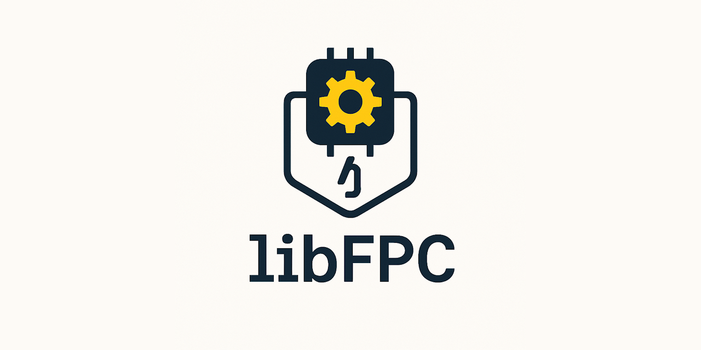

#   
[](https://discord.gg/tPWjMwK) [](https://bsky.app/profile/tinybiggames.com)  

# libFPC

### **FreePascal in your pocket!**

**libFPC** is a Delphi library that embeds the FreePascal Compiler (FPC), enabling your applications to compile Pascal source code at runtime. With libFPC, you can dynamically generate EXEs, DLLs, or other binary outputs without invoking external toolchains or requiring any manual steps from users.

Whether you're building a plugin architecture, scripting engine, code playground, or runtime compiler toolchain—libFPC puts FreePascal’s power directly into your application.

## ✨ Features

- 🛠️ **Runtime compilation** of Pascal source code using FPC  
- ⚙️ Generate **EXEs**, **DLLs**, or custom binaries from within your Delphi app  
- 🚀 **True native compilation** with full control over the build process  
- 🔧 Supports build modes, version info, output paths, icons, and more via inline project directives  
- 🧩 Ideal for scripting, plugin frameworks, live coding environments, and automation tools

## 🚧 Project Status

> **This repository is under active development.**  
> The core functionality is **stable and usable**. Additional features, examples, and documentation are in progress and will be released incrementally. Feedback, issues, and contributions are welcome!

## 📦 Installation

Getting started with `libFPC` is quick and easy:

1. **Download** `libFPC` from the [github](https://github.com/tinyBigGAMES/libFPC/archive/refs/heads/main.zip).  You can also fork the repo if you wish to make contributions.
2. **Add** `libFPC` to your `uses` clause.  
3. **Start Coding!** Enjoy simplified JSON handling with method chaining.  

## 🚀 Basic Usage

Here’s how to compile a Pascal source file (`test1.pas`) into an executable from your Delphi code:

```pascal
procedure Test1();
var
  LlibFPC: TLibFPC;
begin
  // Create an instance of TLibFPC
  LlibFPC := TLibFPC.Create();
  try
    // Assign the Pascal source file to compile
    LlibFPC.SetProjectFilename('test1.pas');

    // Compile the file and display the result
    if LlibFPC.Compile() then
      WriteLn('Success!')
    else
      WriteLn('Failed!');
  finally
    LlibFPC.Free();
  end;
end;
```

## 🧾 Project Directives

libFPC supports special **inline directives** in the main Pascal source file to control project settings, compilation behavior, and output metadata. These must appear at the top of the file, in the format shown below:

```pascal
{==================== [PROJECT DIRECTIVES] =================================}
{@APPTYPE        CONSOLE}              // CONSOLE | GUI
{@OUTPUTPATH     ".\"}                 // Output directory
{.@EXEICON       ".\icon.ico"}         // Optional icon (remove '.' before @ to activate)
{@SEARCHPATH     ".\"}                 // Additional unit search paths
{@BUILDCONFIG    RELEASE}              // DEBUG | RELEASE
{@ADDVERSIONINFO NO}                   // YES | NO
{@MAJORVER       1}
{@MINORVER       0}
{@PATCHVER       0}
{@DESCRIPTION    "Your Project"}
{@COMPANYNAME    "Your Company"}
{@COPYRIGHT      "Copyright © 2024-present Your Company™"}
{@TRADEMARK      "All Rights Reserved."}
{@COMMENT        "http://yourcompany.com"}
{===========================================================================}

program test1;

uses
  sysutils;

var
  i: integer;  
begin
  for i := 1 to 20 do
    writeln(i);
end.
```

These directives allow you to define everything from application type and versioning to icon resources and search paths—ensuring clean and controlled builds right from your source code.

## 💬 Support & Resources

- 🐞 **Report Issues:** [GitHub Issue Tracker](https://github.com/tinyBigGAMES/libFPC/issues)  
- 💬 **Join the Community:** [Forum](https://github.com/tinyBigGAMES/libFPC/discussions) | [Discord](https://discord.gg/tPWjMwK)  
- 📚 **Learn Delphi:** [Learn Delphi](https://learndelphi.org)  

## 🤝 Contributing

We welcome contributions to **libFPC**! 🚀  

### 💡 Ways to Contribute:
- 🐛 **Report Bugs** – Help improve `libFPC` by submitting issues.  
- ✨ **Suggest Features** – Share ideas to enhance its functionality.  
- 🔧 **Submit Pull Requests** – Improve the codebase and add features.  

### 🏆 Contributors

<a href="https://github.com/tinyBigGAMES/libFPC/graphs/contributors">
  
</a>

## 📜 License

**libFPC** is distributed under the **BSD-3-Clause License**, allowing redistribution and modification in both source and binary forms. 
See the [LICENSE](https://github.com/tinyBigGAMES/libFPC?tab=BSD-3-Clause-1-ov-file#BSD-3-Clause-1-ov-file) for details.

## 💖 Support & Sponsorship

Your support keeps **libFPC** evolving! If you find this library useful, please consider [sponsoring the project](https://github.com/sponsors/tinyBigGAMES). Every contribution helps drive future enhancements and innovations.

### Other ways to support:
- ⭐ **Star the repo** – Show your appreciation.  
- 📢 **Share with your network** – Spread the word.  
- 🐛 **Report bugs** – Help improve `libFPC`.  
- 🔧 **Submit fixes** – Contribute by fixing issues.  
- 💡 **Suggest features** – Help shape its future.  

🚀 Every contribution makes a difference – thank you for being part of the journey!  
  
---

🔥 *libFPC – FreePascal in your pocket!*

<p align="center">
  
</p>
<h5 align="center">Made with ❤️ in Delphi</h5>

